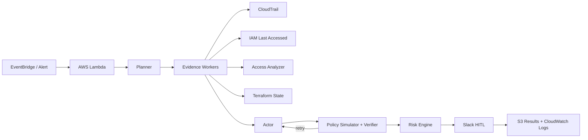
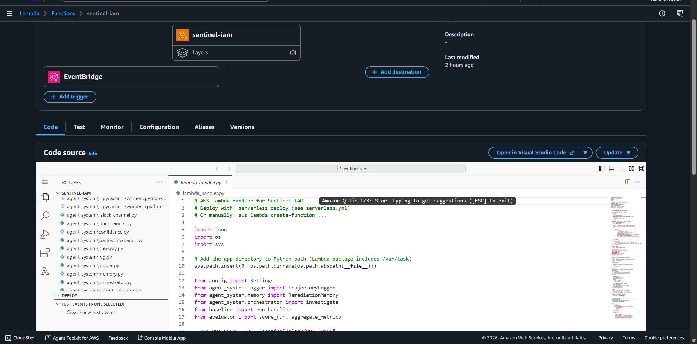
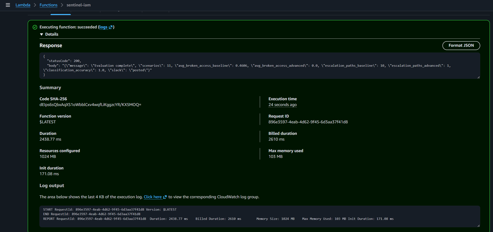
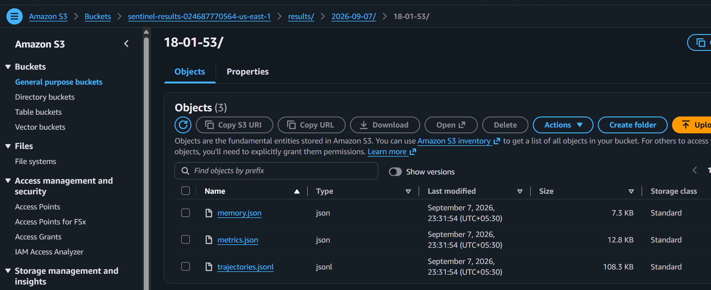
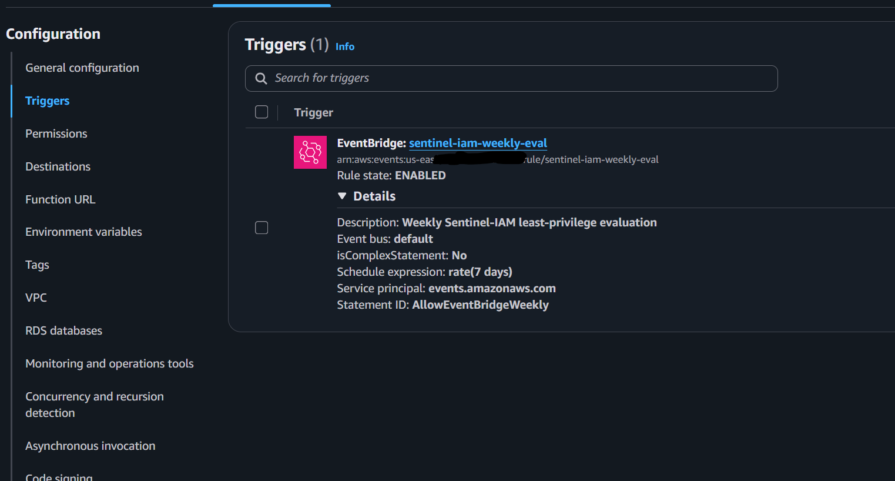
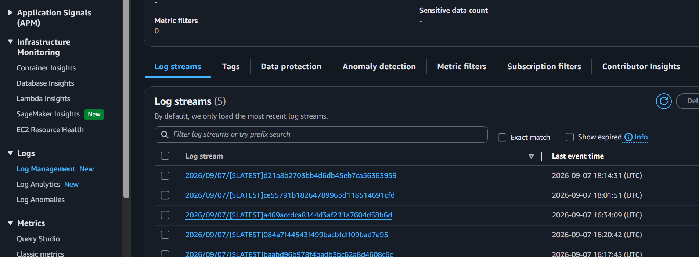
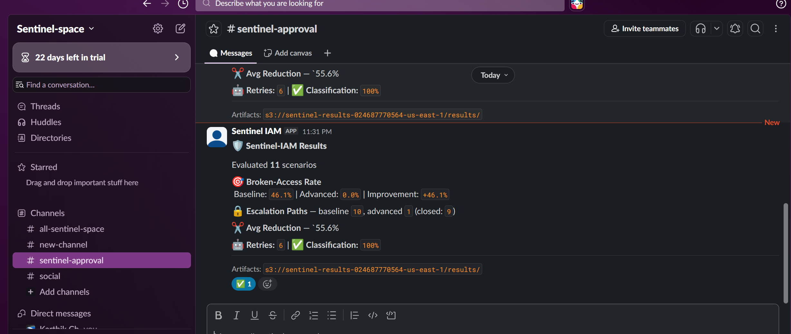
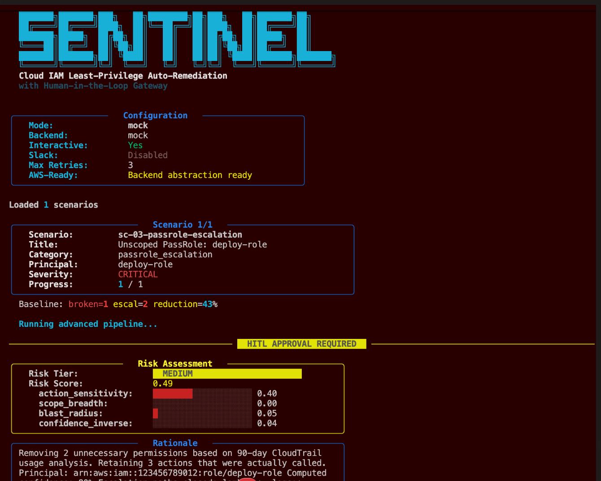
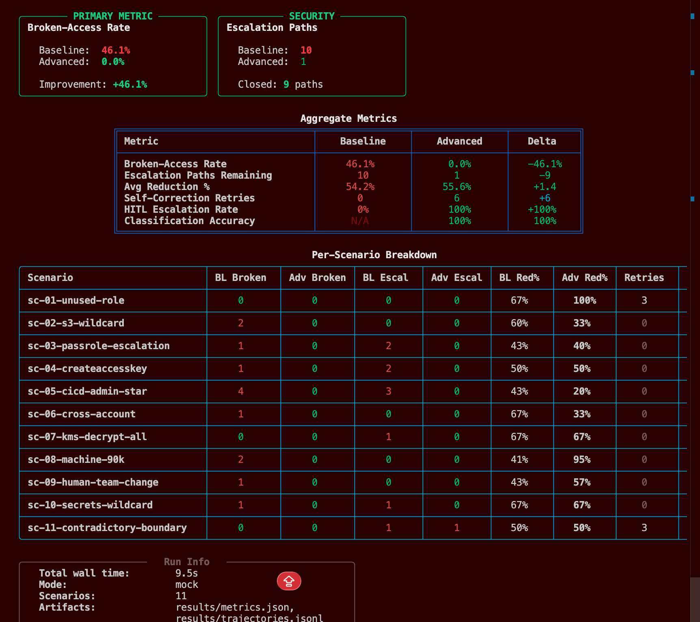

<div align="center">

# Sentinel-IAM

### Evidence-driven IAM least-privilege remediation with deterministic verification and human approval

`AWS Lambda` · `CloudTrail` · `IAM Access Analyzer` · `Amazon S3` · `Slack HITL`

</div>

## Architecture



Sentinel-IAM collects real usage and policy evidence from AWS, then uses an agent workflow to propose a least-privilege IAM policy. Every proposal is checked by a deterministic policy simulator and verifier; failed checks are returned to the actor for correction.

Verified changes are risk-scored before execution. Sensitive remediations require human approval through Slack, while run metrics, audit traces, and remediation memory are stored in Amazon S3 and execution logs are captured in CloudWatch.

## Results

| Metric | Baseline | Sentinel-IAM |
|---|---:|---:|
| Broken-access rate | 46.06% | **0%** |
| Escalation paths remaining | 10 | **1** |
| Classification accuracy | 0% | **100%** |
| Average permission reduction | 54.2% | **55.6%** |

Evaluation: **11 IAM scenarios**. Full artifacts: [`metrics.json`](metrics.json), [`memory.json`](memory.json), and [`trajectories.jsonl`](trajectories.jsonl).

## AWS Deployment

Sentinel-IAM runs on AWS Lambda, stores evaluation artifacts in Amazon S3, emits execution logs to CloudWatch, and is scheduled through EventBridge.







<p align="center">
  
  
</p>

## Human Approval

Risk-scored remediation summaries are delivered from AWS to Slack for review and approval.



## Local Evaluation

```bash
python scripts/generate_data.py
python evaluator.py
```

<p align="center">
  
  
</p>
